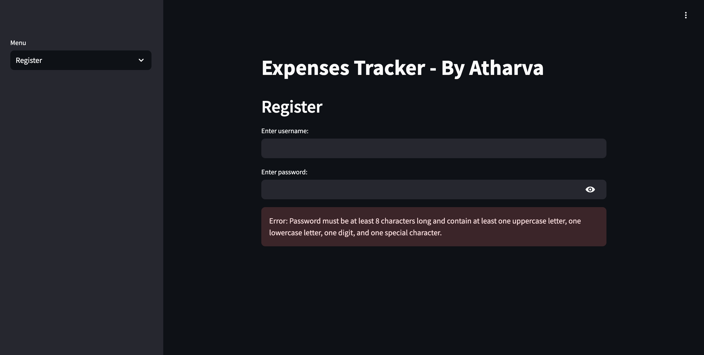
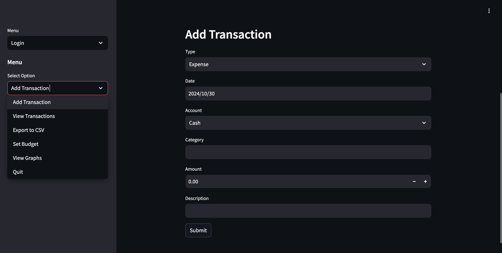

## Expenses Tracker - By Atharva

### Overview
This project is a personal finance tracker application built using Python and Streamlit, allowing users to log, categorize, and analyze their expenses and income. It includes features for registration, authentication, transaction tracking, budget setting, and visual analysis of expenses through graphs.

### Features
- **User Authentication:** Secure login and registration system.
- **Expense and Income Tracking:** Log expenses and income by category, date, and account type.
- **Budget Management:** Set monthly budgets to manage your finances effectively.
- **Data Export:** Export your transactions to CSV.
- **Visualization:** View monthly and yearly breakdowns of expenses and income through pie charts and bar charts.

### Installation

1. **Clone the Repository:**
   ```bash
   git clone https://github.com/atharva39/ExpensesTracker.git
   cd ExpensesTracker
   ```

2. **Install Required Libraries:**
   Make sure you have Python installed. You can install the required libraries using pip:
   ```bash
   pip install streamlit matplotlib # Windows
   pip3 install streamlit matplotlib # macOS
   ```

3. **Run the Application:**
   To start the application, run:
   ```bash
   streamlit run app.py
   ```

### Usage

1. **Registration:**
   - Launch the application in your browser.
   - Navigate to the registration page by selecting the "Register" option.
   - Enter a unique username and a password that meets the specified requirements (at least 8 characters long, including uppercase, lowercase, digits, and special characters).
   - If successful, you'll see a confirmation message.

2. **Login:**
   - Once registered, navigate to the login page by selecting "Login."
   - Enter your username and password to access your account.
   - If the credentials are valid, you'll be redirected to the main menu.

3. **Adding Transactions:**
   - From the main menu, select "Add Transaction."
   - Fill out the required fields for the transaction, including type, date, account, category, amount, and a description.
   - Submit to save the transaction.

4. **Viewing Transactions:**
   - Select "View Transactions" from the menu to see a list of all your logged transactions.

5. **Setting a Budget:**
   - Choose "Set Budget" to allocate a budget for the current month.

6. **Exporting Data:**
   - Select "Export to CSV" to download your transaction records.

7. **Viewing Graphs:**
   - Use the "View Graphs" option to visualize your monthly and yearly income and expenses using pie charts and bar charts.

### Technologies Used
- **Python:** Programming language used to build the application.
- **Streamlit:** Framework for building interactive web applications.
- **SQLite:** Database used for storing user data and transactions.
- **Matplotlib:** Library for creating visualizations.

### Screenshots (Optional)



### Contact Information
For any inquiries or feedback, please contact me at [atharvapersonal@gmail.com].
